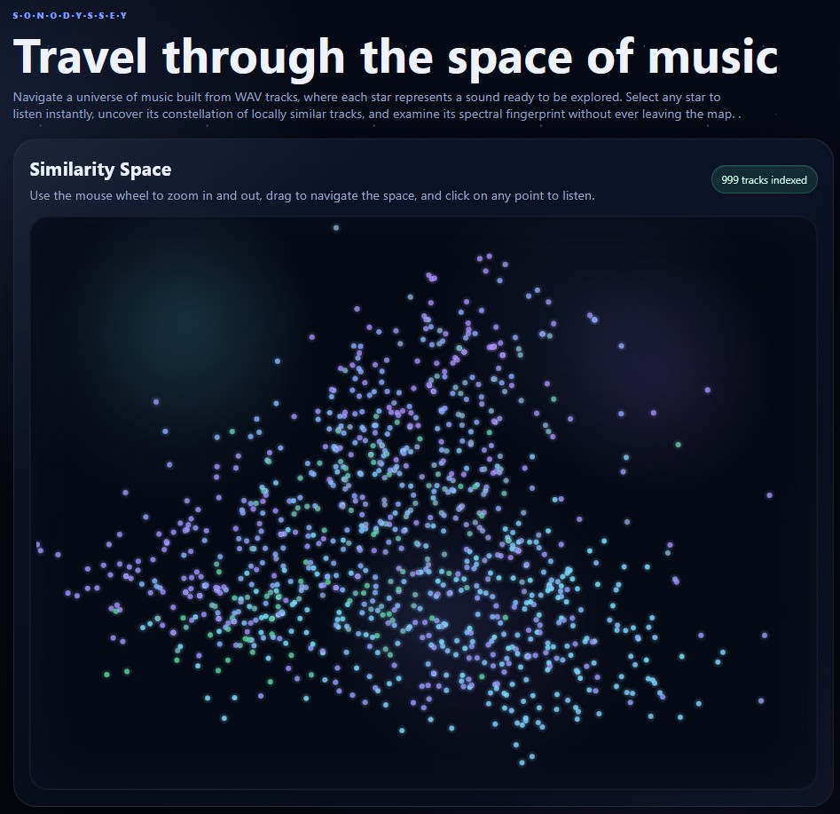
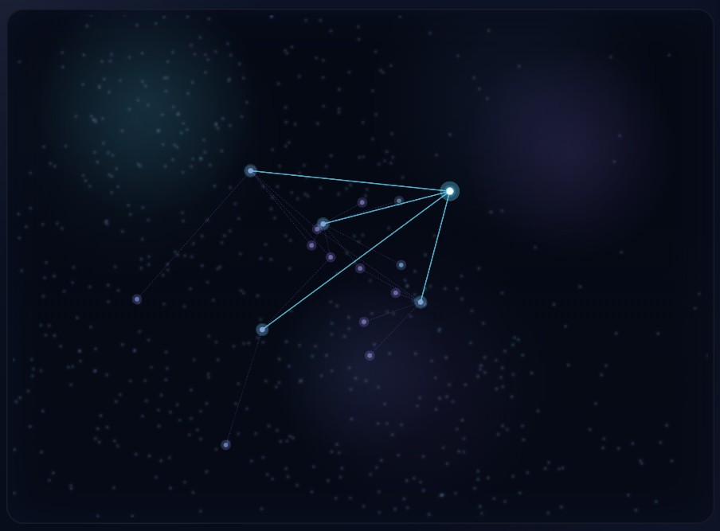
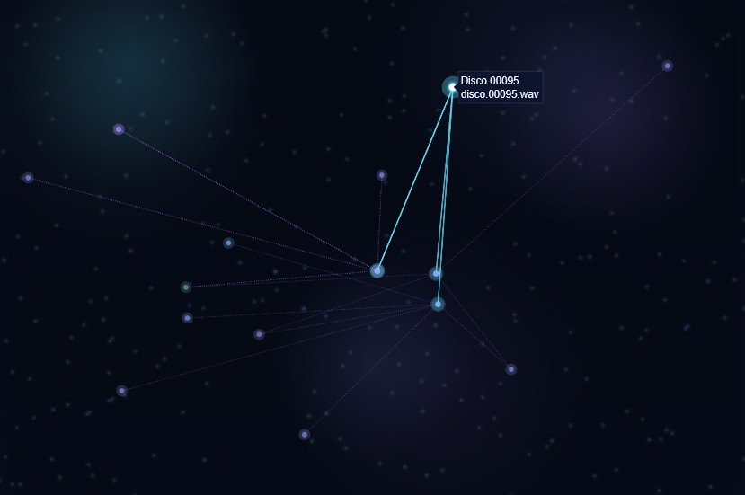
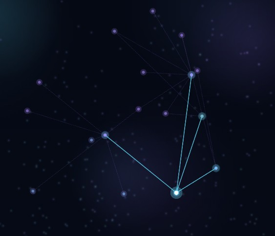
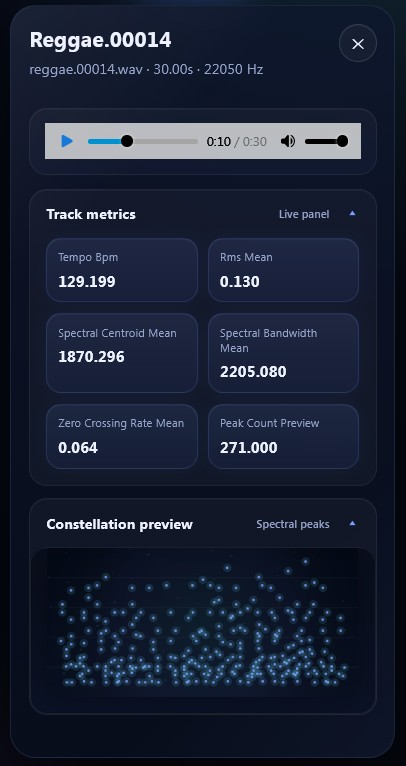

# Sonodyssey — Travel Through the Space of Music

Sonodyssey transforms audio collections into an explorable **cosmic similarity space**, where each track becomes a star and relationships between sounds form dynamic constellations. Built for music intelligence, MIR research, and creative exploration, it allows users to navigate large audio corpora intuitively and interactively.


## Core Experience

Navigate a universe of sound where:

- Each **node (star)** represents a WAV track
- Spatial proximity encodes **acoustic similarity**
- Connections form **local constellations of related sounds**
- Users can **listen, inspect, and analyze** tracks in real time

The system blends **signal processing, embedding projection, and interactive visualization** into a seamless experience.

---

## Similarity Space

The main interface is a fully interactive 2D projection of the audio embedding space. Tracks are distributed to maximize spatial coverage and reveal structural clusters in the dataset.



Users can:
- Zoom and pan smoothly across the space
- Identify clusters of stylistically similar audio
- Click on any node to activate detailed inspection
- Observe global structure emerging from local relationships

This view is backed by dimensionality reduction over high-dimensional feature embeddings.

---

## Dynamic Constellations

Selecting a track reveals its **local neighborhood graph**, forming a constellation of similar **music styles**.





Key properties:
- Edges represent **nearest-neighbor relationships**
- Visual intensity encodes **similarity strength**
- Layout preserves **local topology**
- Animated transitions emphasize structure emergence

This enables rapid auditory discovery and contextual understanding of each track.

---

## Interactive Track Panel

Each selected track opens a **inspection panel**, providing playback and analytical features.



### Features

- **Instant audio playback**
- **Dynamic waveform progress**
- **Volume control**
- High-level descriptors extracted from the signal:
  - Tempo (BPM)
  - RMS energy
  - Spectral centroid
  - Spectral bandwidth
  - Zero-crossing rate
  - Peak density

---

## Spectral Fingerprint Visualization

Each track includes a **constellation preview of spectral peaks**, representing its time-frequency structure.

- Captures the **distribution of dominant frequencies over time**
- Provides a **signature-like fingerprint** of the sound
- Useful for similarity validation and MIR analysis

---

## Underlying Technology

Sonodyssey is built on a robust MIR pipeline:

- **Feature Extraction**
  - Spectral descriptors
  - Temporal statistics
  - Energy-based features

- **Embedding Construction**
  - High-dimensional vector representation per track

- **Normalization & Scaling**
  - Standardization across dataset

- **Projection**
  - Dimensionality reduction (e.g., PCA / UMAP)

- **Similarity Computation**
  - Euclidean distance matrix
  - k-NN graph construction

- **Frontend Rendering**
  - Canvas-based real-time visualization
  - Animated graph transitions
  - GPU-friendly rendering patterns


---

## Features

- end-to-end audio processing from raw WAV files
- MIR feature extraction with `librosa`
- similarity indexing and nearest-neighbor retrieval
- dimensionality reduction for interactive exploration
- browser playback tied to analysis results
- a documented HTTP API with FastAPI and Swagger
- professional project layout ready to extend

---

## Core features

- **WAV ingestion** from `data/wav`
- **Feature extraction** using mel-spectrograms, MFCCs, chroma, spectral centroid, bandwidth, RMS, and zero-crossing rate
- **Constellation preview** based on spectral peak detection
- **Track embeddings** derived from aggregated MIR descriptors
- **2D projection map** with PCA for interactive browsing
- **Nearest-neighbor search** over the indexed tracks
- **FastAPI backend** with JSON endpoints and automatic docs
- **Uvicorn-ready development workflow**
- **Single-page frontend** with Plotly visualization and in-browser audio playback

---

## Demo experience

Once the server is running, the app provides a polished workflow:

1. Drop your WAV files into `data/wav/`
2. Build or rebuild the index
3. Open the browser demo
4. Click points in the similarity map
5. Listen to the selected track
6. Inspect MIR metrics and a spectral constellation preview
7. Jump to the nearest neighbors from the side panel


---

## Repository structure

```text
sonodyssey/
├── data/
│   └── wav/                     # Put your .wav files here
├── outputs/                     # Generated index and projection JSON files
├── scripts/
│   ├── run_dev.ps1
│   └── run_dev.sh
├── src/
│   └── sonodyssey/
│       ├── api/
│       │   ├── cli.py
│       │   ├── dependencies.py
│       │   └── main.py
│       ├── core/
│       │   ├── audio_features.py
│       │   ├── config.py
│       │   ├── indexer.py
│       │   ├── logging.py
│       │   └── schemas.py
│       ├── static/
│       │   ├── css/styles.css
│       │   ├── js/app.js
│       │   └── index.html
│       └── __init__.py
├── tests/
├── .gitignore
├── LICENSE
├── pyproject.toml
├── README.md
└── requirements.txt
```

---

## Installation

### 1. Create and activate a virtual environment

**Windows PowerShell**

```powershell
python -m venv .venv
.\.venv\Scripts\Activate.ps1
```

**Linux / macOS**

```bash
python -m venv .venv
source .venv/bin/activate
```

### 2. Install the project

```bash
pip install -e .
```

Or, if you prefer a plain requirements-based install:

```bash
pip install -r requirements.txt
```

---

## Quick start

### 1. Add audio files

Copy your `.wav` files into:

```text
data/wav/
```

### 2. Build the similarity index

```bash
ace-build-index
```

This creates:

- `outputs/index.json`
- `outputs/projection.json`

### 3. Run the API with Uvicorn

```bash
uvicorn sonodyssey.api.main:app --reload
```

Open the app at:

```text
http://127.0.0.1:8000/
```

Swagger docs are available at:

```text
http://127.0.0.1:8000/docs
```

---

## Alternative CLI workflow

The project also exposes two console commands:

```bash
ace-build-index
ace-serve --reload
```

You can also specify host and port:

```bash
ace-serve --host 0.0.0.0 --port 8000 --reload
```

---

## API overview

### `GET /api/health`
Returns server status and the number of indexed tracks.

### `GET /api/tracks`
Returns lightweight metadata for all indexed tracks.

### `GET /api/tracks/{track_id}`
Returns detailed information for a single track, including:

- global metrics
- nearest neighbors
- spectral constellation preview points

### `GET /api/projection`
Returns the 2D map coordinates for the full collection.

### `POST /api/rebuild`
Rebuilds the index from the contents of `data/wav/`.

### `GET /api/audio/{file_name}`
Streams the original WAV file to the browser audio player.

---

## Technical design

### Feature representation

Each track is loaded in mono at a fixed sample rate and summarized through a compact descriptor based on:

- chroma mean and standard deviation
- MFCC mean and standard deviation
- spectral centroid statistics
- spectral bandwidth statistics
- zero-crossing rate statistics
- RMS statistics
- estimated tempo

This gives a stable baseline embedding that is light enough for demos and fast iteration, while remaining meaningful for similarity browsing.

### Constellation map preview

The frontend constellation view is generated from local maxima in the log-mel representation. It is intended as a compact visual signature rather than a full fingerprinting implementation.

### Projection

The current base project uses **PCA** for a deterministic and lightweight 2D projection. The code is structured so you can later replace PCA with:

- t-SNE
- UMAP
- metric-learning embeddings
- contrastive audio encoders

### Similarity

Nearest neighbors are computed with Euclidean distance in the standardized feature space. This is simple, fast, and easy to explain in interviews and documentation.


---

## Author

Brian Martínez-Rodríguez

GitHub: https://github.com/BrianComposer

Email: info@brianmartinez.music

Web: www.brianmartinez.music

## License

MIT License.
